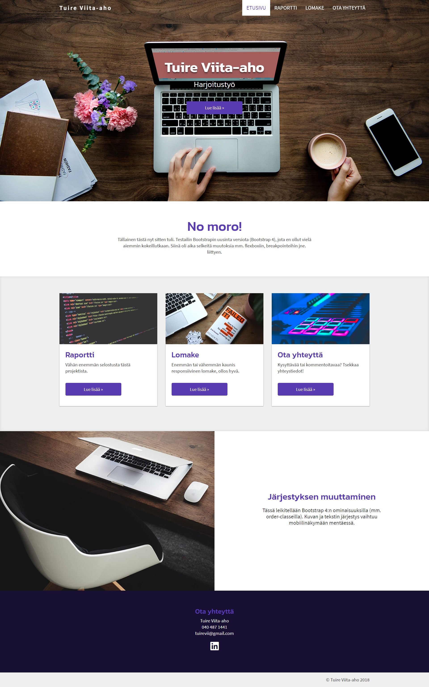
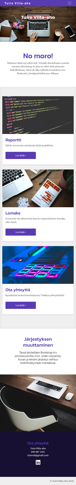
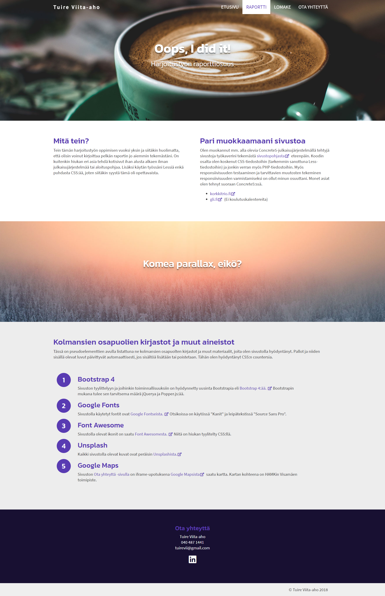
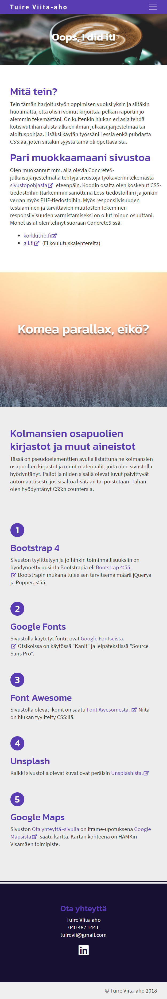
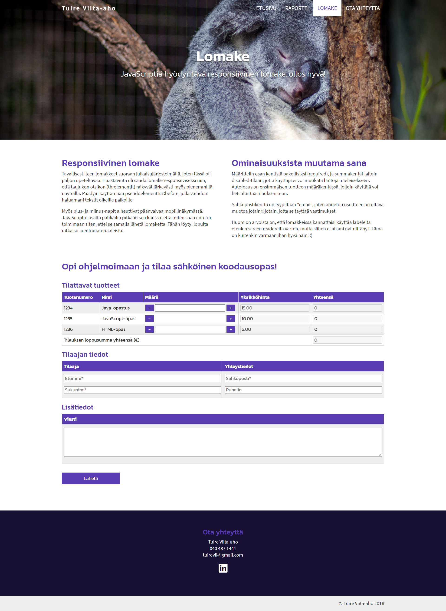
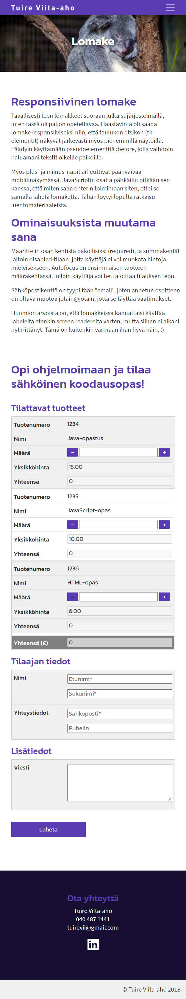
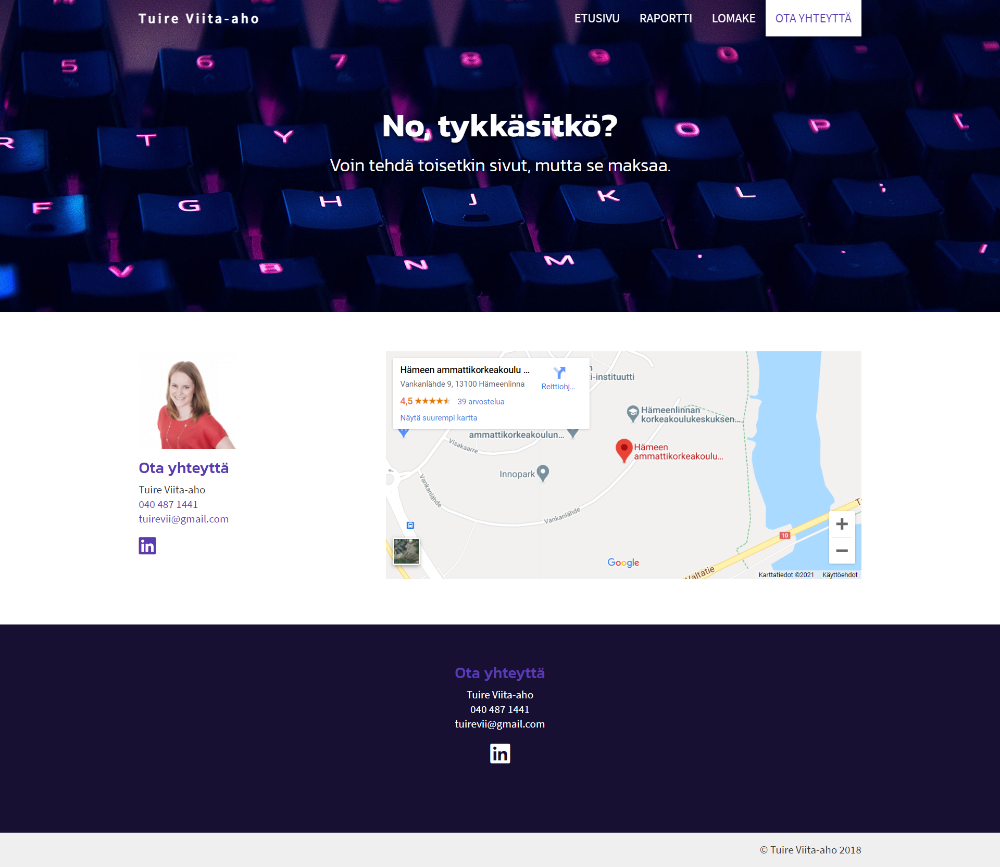
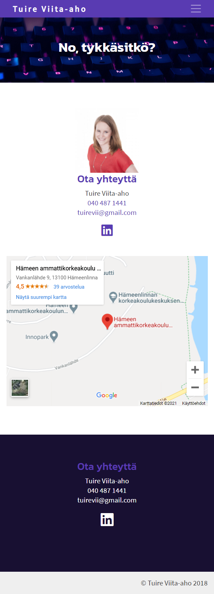

# Website exercise

## About
I created this responsive website in 2018 for a school project while studying business information technology in the Häme university of applied sciences. The technologies I used were **HTML5, CSS, Bootstrap 4 and JavaScript**. Fonts were from Google Fonts and icons from Font Awesome. 

The website consists of four pages and the content is in Finnish even though it could have been just lorem ipsum. The focus was in the technique and UI, not in the content including text and images.
Each page has an image on the top and a footer on the bottom. The navigation is fixed and gets a purple background on scroll and in mobile view.

### Main page (index.html)
Desktop view:

Mobile view:

### Second page (raportti.html)
Desktop view:

Mobile view:

### Third page (lomake.html)
In this page there's a form which utilises also JavaScript. The user can select the amount of each product she/he wants to order and the total price will increase (or decrease) based on the amount and the price of the added (or removed) product. Submitting the form will send all the information to a test site located in https://wwwkayttoliittyma.appspot.com/printvalues.

Desktop view:

Mobile view:

### Fourth page (otayhteytta.html)
Desktop view:

Mobile view:

## Requirements
* Clone or download the files into your computer
* Double click the index.html file to open the main page
